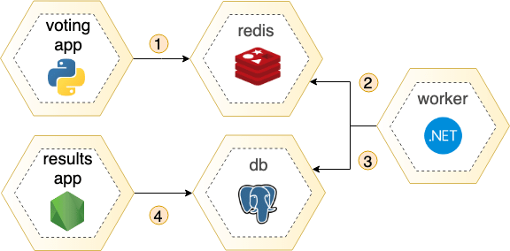

# Example Voting App

This is a fork from:   https://github.com/dockersamples/example-voting-app.  
I am using this code to study and this repository is part of my little DevOps project https://github.com/leohauschild/devops_project.
## Architecture



* A front-end web app in [Python](/vote) which lets you vote between two options
* A [Redis](https://hub.docker.com/_/redis/) which collects new votes
* A [.NET](/worker/) worker which consumes votes and stores them in…
* A [Postgres](https://hub.docker.com/_/postgres/) database backed by a Docker volume
* A [Node.js](/result) web app which shows the results of the voting in real time

## Notes

The voting application only accepts one vote per client browser. It does not register additional votes if a vote has already been submitted from a client.

This isn't an example of a properly architected perfectly designed distributed app... it's just a simple
example of the various types of pieces and languages you might see (queues, persistent data, etc), and how to
deal with them in Docker at a basic level.

## Usage

### Deploy yaml files: 

For simple usage, we can install the app using the yaml files [simple-deploy-yaml](/simple-deploy-yaml)
```
kubectl apply -f simple-deploy-yaml/
```

### Deploy using Helm:
First, add Helm chart repo:
```
helm repo add vote-app-helm https://leohauschild.github.io/simple-voting-app/charts/vote-app
```

And after install chart:
```
helm install vote-app vote-app-helm/vote-app -n vote-app -f values.yaml
```
Make sure that you create namespace **vote-app** on your cluster, or you can change it by installing the chart on another namespace.   
The file **values.yaml** you can overwrite as you want. 
